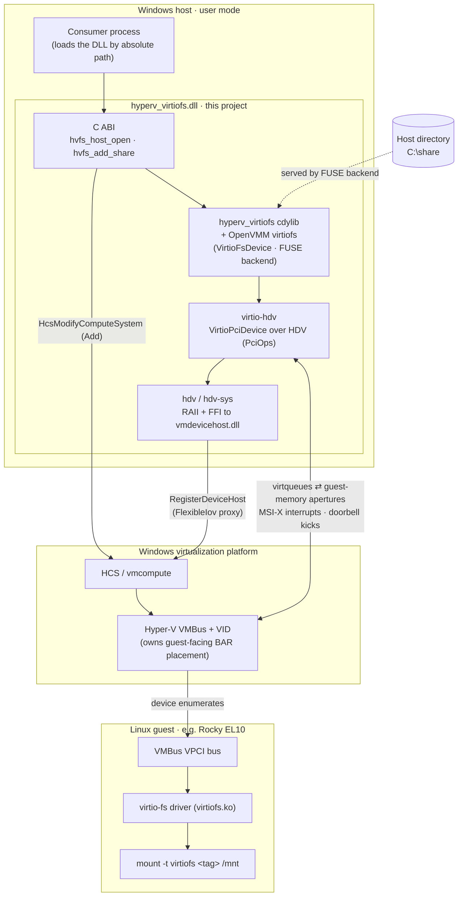

# hyperv-virtiofs

[](https://github.com/jlagedo/hyperv-virtiofs/actions/workflows/ci.yml)
[](LICENSE)


**virtiofsd for Hyper-V.** A standalone C-ABI DLL that attaches an
[OpenVMM](https://github.com/microsoft/openvmm) **virtio-fs** device to *any*
HCS / Hyper-V guest via the Windows **Host Device Virtualization (HDV)** API — so a
host process can share a host directory into a VM over virtio-fs, with no 9p and no
in-box device support.

It is the open counterpart to the device-host glue that ships **closed** inside
WSL's `wsldevicehost.dll`.

> **Status: it works through the C ABI, including live multi-share.** A stock Rocky
> Linux 10 (EL10) guest under Hyper-V/HCS **mounts a host directory over our HDV
> virtio-fs bridge** — reads a host file and writes one back — with no 9p and no
> kernel changes, driven entirely through the exported ABI
> (`hcs-testvm/tests/attach_abi.rs`). Shares are **hot-added live** to a running VM,
> one virtio-fs device per share (`hvfs_add_share`), so a host can map new directories
> on the fly. The transport (`virtio-hdv`) drives OpenVMM's public
> `VirtioPciDevice`/`VirtioFsDevice` over the `ExternalRestricted` FlexibleIov proxy
> path. Remaining for product use: live share **removal** (the platform refuses
> `FlexibleIov` Remove — devices are reclaimed at VM teardown, as WSL does; see
> [`docs/share-abi.md`](docs/share-abi.md)), `ro` enforcement, and a fully coherent
> guest-memory mapping (HDV apertures are an evictable cache; the proof uses a
> persistent mapping + interrupt re-arm + boot retry to mask the residual staleness).
> See [Roadmap](#roadmap).

## Why

Modern enterprise-Linux guests (RHEL/Rocky/Alma EL10) drop the `9p` filesystem but
ship `virtiofs.ko` in-box. On Windows, HCS exposes Plan 9 sharing but **no**
virtio-fs device. HDV is the documented escape hatch: a host-side user-mode process
can register a *custom* virtual device against a compute system it owns. This
project puts a real virtio-fs device on that escape hatch — empirically, a stock
EL10 kernel mounts an OpenVMM virtio-fs share read-write under WHP (proof in the
design notes).

## How it works

The DLL stands up a **virtio-fs device** on the HDV escape hatch and runs the FUSE
server for it in-process, so a host directory surfaces as a normal mount inside the
guest. The crate stack (top → bottom) maps onto the platform like this:



- **Control path (setup, solid arrows):** the consumer registers one HDV device host
  against its compute system (`hvfs_host_open`) and hot-adds a virtio-fs device per share
  (`hvfs_add_share` → `HcsModifyComputeSystem` Add). The Hyper-V VID surfaces the device on
  the guest's VPCI bus, where `virtiofs.ko` binds it and the guest mounts the `tag`.
- **Data path (runtime, double arrow):** the guest driver and our in-process
  `VirtioFsDevice` exchange FUSE requests over virtqueues. `virtio-hdv` backs those seams
  with HDV — guest memory via apertures, kicks via doorbells, completions via MSI-X — and
  the FUSE backend services each request against the host directory.

## Design: agnostic by construction

The product's entire contract is the C ABI in
[`include/hyperv_virtiofs.h`](include/hyperv_virtiofs.h). It contains **no**
consumer-specific concepts — its vocabulary is purely *compute systems, device hosts,
shares, tags, read-only*. It names the real shape of the stack — a **device host**
carrying **N hot-added virtio-fs devices** (one per share) — rather than imitating any
one consumer's share semantics. Any host can drive it. Full design + rationale:
[`docs/share-abi.md`](docs/share-abi.md).

```c
uint32_t hvfs_abi_version(void);  // 2
// Register the single HDV device host against a compute system (BEFORE start).
int32_t  hvfs_host_open(const char *hcs_system_id, const char *host_json, hvfs_host **out);
// Hot-add one virtio-fs device == one share (AFTER start). One handle per share.
int32_t  hvfs_add_share(hvfs_host *host, const char *share_json, hvfs_share **out);
const char *hvfs_share_instance_id(const hvfs_share *share);  // the on-wire DeviceInstanceId
// Best-effort live remove (UNSUPPORTED on current Windows -> reclaim at teardown).
int32_t  hvfs_remove_share(hvfs_share *share);
// Tear down every device + the host + the system handle.
int32_t  hvfs_host_close(hvfs_host *host);
const char *hvfs_last_error(void);
void     hvfs_set_logger(hvfs_log_fn cb, void *ctx);
```

Contract rules: `0` = OK / `< 0` = error (details in the thread-local
`hvfs_last_error`); opaque handles; **every** `const char*` is borrowed (no caller
`free`); and **no Rust panic ever crosses the boundary** — every entry point runs
under `catch_unwind` and returns `HVFS_ERR_PANIC` instead of aborting the host.

`hvfs_host_open`'s `host_json` is just the guest RAM (`{ "memory_mb": 512 }`, the GPA
ceiling each device's DMA may reference; it must equal the compute system's RAM). The
caller's create document declares **no** `FlexibleIov` slots — shares are hot-added at
runtime. `hvfs_add_share`'s `share_json` is one share:

```json
{ "tag": "ws", "path": "C:\\host\\dir", "instance_id": "c1c1c1c1-3333-4333-8333-333333333333", "ro": false }
```

`tag` is the virtio-fs mount tag (`mount -t virtiofs <tag> …`), `path` the host
directory, and `instance_id` the device's **required** unique `DeviceInstanceId` (the
caller owns uniqueness; the device *class* is the well-known virtio-fs id by platform
necessity, not caller-chosen). `ro: true` currently returns `HVFS_ERR_NOT_IMPLEMENTED`
— read-only is not yet enforced and the ABI won't claim a guarantee it can't keep.

## Crate layering

| Crate | Responsibility |
|---|---|
| `hdv-sys` | Raw FFI to the HDV API (`HdvInitializeDeviceHost`, `HdvCreateDeviceInstance`, guest-memory apertures, doorbells). |
| `hdv` | Safe RAII over `hdv-sys`. Device-agnostic — usable for any HDV device. |
| `virtio-hdv` | OpenVMM virtio transport carried over HDV (guest memory ← apertures, kick ← doorbells, config space). Device-neutral. |
| `hyperv_virtiofs` | The `cdylib`: wires OpenVMM's `virtiofs` onto `virtio-hdv`; exposes the C ABI. |

The lower three crates are a reusable "HDV device toolkit"; virtio-fs is just the
first device on top. They can be split to crates.io later if a second device wants
them.

This layering mirrors WSL's closed `wsldevicehost.dll` (1.6 MB, Rust). Its embedded
source paths split by depot prefix: **`oss\…`** = the public `microsoft/openvmm` tree
(`virtio`, `virtiofs`, `pci_core`, `fuse`, `lxutil`, `guestmem` — exactly what we reuse),
and **`hyper-v\…`** = Microsoft's internal Windows depot (not mirrored): an `hdv` crate
(`api.rs` ≈ our `hdv-sys`+`hdv`; `virtio_hdv.rs` ≈ our `virtio-hdv`; `virtiofs.rs` ≈ the
`cdylib` wiring) plus a `wsldevicehost` COM/DLL shim we don't need. So `virtio-hdv` is the
open re-implementation of one internal file (`virtio_hdv.rs`) over otherwise-public crates.

## Build

Prerequisites: a Rust 1.95+ toolchain and **`protoc`** (the reused OpenVMM crates
pull `mesh → prost → protobuf`, whose build needs the Protocol Buffers compiler).
Install it from your package manager or the [protobuf releases](https://github.com/protocolbuffers/protobuf/releases),
and ensure it's on `PATH` (or set the `PROTOC` env var to the binary).

```pwsh
cargo build --release          # -> target/release/hyperv_virtiofs.dll (+ .dll.lib, .pdb)
cargo test --workspace
cbindgen --config cbindgen.toml --crate hyperv_virtiofs --output include/hyperv_virtiofs.h
```

The OpenVMM crates are git dependencies pinned to one revision in the workspace
`Cargo.toml`; the first build fetches that tree (large) and compiles it.

CI (`windows-latest`) builds, clippy-gates, runs tests, and **fails if the committed
header drifts** from the Rust source. Tagged `v*` pushes publish a GitHub release
carrying `hyperv_virtiofs.{dll,dll.lib,pdb}` + the header — the bundle a consumer
**pins** (it does not build this from source).

## Testing

Two tiers. The **unit / build gates** (`cargo test --workspace`, clippy, fmt,
header-freshness) run on CI. The **end-to-end suite** boots a real Rocky Linux 10 guest
under Hyper-V and drives the stack up a ladder — *rig boot → proxy transport → cold
virtio-fs mount → live hot-add → the shipped C ABI* — proving a stock EL10 kernel mounts a
host directory over our bridge with no 9p and no guest changes. It's `#[ignore]`d (needs a
Hyper-V host + guest artifacts, so not on hosted CI) and reproducible from a clone:

```pwsh
.\test\build-guest-artifacts.ps1   # once: build the guest kernel + initramfs (Docker via WSL)
.\test\run-e2e.ps1                 # run the ladder, print a PASS/FAIL summary
```

Full guide — prerequisites, the test ladder, the guest↔test sentinel contract, and
troubleshooting — is in [`docs/testing.md`](docs/testing.md).

## Roadmap

What's **shipped** and what's still **open** — live share removal (platform-blocked), `ro`
enforcement, and self-hosted e2e CI — is tracked in one place:
[`docs/roadmap.md`](docs/roadmap.md).

## Contributing & security

- **Contributing** — build, test, and PR guidance, plus the ABI-change process:
  [`CONTRIBUTING.md`](.github/CONTRIBUTING.md).
- **Open work** — everything left to develop, confirm, or unblock lives in
  [`docs/roadmap.md`](docs/roadmap.md).
- **Security** — this DLL sits on the host↔guest boundary; report vulnerabilities
  privately per [`SECURITY.md`](.github/SECURITY.md), not via public issues.
- **Conduct** — [`CODE_OF_CONDUCT.md`](.github/CODE_OF_CONDUCT.md).

## License

[MIT](LICENSE). Reuses MIT-licensed OpenVMM virtio crates — see [NOTICE](NOTICE).
